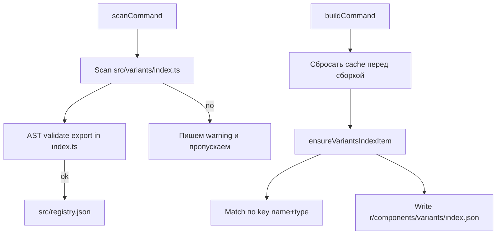

## Цель

Сделать поведение предсказуемым в цепочке `scan -> build -> publish`, сохранив ручную публикацию пакета.

## Текущее поведение и причина расхождения

- `[src/commands/scan.ts](src/commands/scan.ts)` обрабатывает `src/variants/index.ts` как отдельный элемент, но валидация экспорта не ловит `export *`/реэкспорты, из‑за чего `npx ui8kit scan` может не записывать его в `items`.
- `[src/commands/build.ts](src/commands/build.ts)` принудительно синхронизирует синтетический элемент через `name: "index"` и перезаписывает любой существующий `index` в реестре, без привязки к типу.
- `[src/commands/build.ts](src/commands/build.ts)` не сбрасывает кеш, поэтому в сценариях с ручной отладкой и обновлениями версии можно подхватить устаревшие локальные/временные данные по registry flow.

## План архитектурно (как это должно работать)

## План изменений

- Ввести AST-валидацию экспорта для элементов, чтобы `scan` корректно находил `index.ts` варианта.
  - Файл: `[src/commands/scan.ts](src/commands/scan.ts)`
  - Изменения: заменить логику `hasValidExports` на разбор через TypeScript AST и поддержку `ExportDeclaration`, `ExportAssignment`, `export *` и `export {}`-форм.
  - Сценарий: файл `src/variants/index.ts` с `export * from "./button"` должен считаться валидным и попадать в `items`.
- Привязать синтетическое добавление `variants/index.ts` к типу `registry:variants` и не затрагивать другие `index` в `registry:components`.
  - Файл: `[src/commands/build.ts](src/commands/build.ts)`
  - Изменения: в `ensureVariantsIndexItem` и месте слияния использовать ключ `type:name` (например `registry:variants:index`) вместо поиска только по `name`.
  - Если в `registry.json` уже есть компонент с другим типом и тем же именем (`components:index`), не заменять его и добавить отдельный `variants:index` запись.
- Перенести/вычистить извлечение зависимостей для синтетического индекса в единый устойчивый AST-путь.
  - Файл: `[src/commands/build.ts](src/commands/build.ts)`
  - Изменения: заменить regex-выдирание зависимостей из `extractFileDependencies` на AST-парсер (аналогично логике scan), чтобы не пропускались/не ошибочно включались импорты.
- Добавить обязательный сброс кеша в начале сборки.
  - Файлы: `[src/commands/build.ts](src/commands/build.ts)` и `[src/utils/cache.ts](src/utils/cache.ts)`
  - Вызвать `clearCache()` и `resetCache()` (если нужен полный сброс) перед чтением входного `registry.json` и перед циклом генерации артефактов.
  - Поведение: build всегда начинает с чистого локального состояния и не опирается на устаревшие данные из `.ui8kit/cache`.
- Зафиксировать регламент и защитить регрессию тестами.
  - Файл: `[tests/commands/scan.test.ts](tests/commands/scan.test.ts)`
    - добавить кейс: `variants/index.ts` с `export *` попадает в `items`.
    - добавить кейс: `components/index.ts` и `variants/index.ts` независимо существуют в manifest.
  - Файл: `[tests/commands/build.test.ts](tests/commands/build.test.ts)`
    - добавить кейс: при `registry.json` с `components:index` + `registry:variants:index` сборка создаёт корректный `r/components/variants/index.json`, не перезаписывая `components:index` запись.
  - Файл: `[tests/commands/cache.test.ts](tests/commands/cache.test.ts)`
    - при необходимости добавить тест, что build триггерит очистку кеша (моками).

## Дополнительно как best practice

- Зафиксировать порядок релизного процесса в `README.md`:
  - `scan` -> `build` (внутри пакета) -> `npm publish`.
  - В приложении `init/add` использовать `@latest` только с пониманием TTL или явно `--no-cache`, плюс фиксированные версии для репродюсевости.
- Проверить naming convention для будущих индексов: либо оставить `index`, но с типом как явным ключом, либо перейти на `variants-index`/`components-index` в артефактах для прозрачности.
- Рассмотреть отдельный тестовый сценарий на E2E, где обновленный `@ui8kit/registry` подтягивается корректно в `react-vite/src/variants/index.ts` после `init`/sync.

