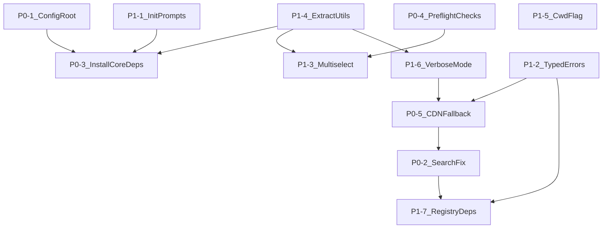

# UI8Kit CLI P0-P1 Improvements

## P0 -- Critical Bugs and Missing Functionality

### P0-1. Config file in project root (not in `src/`)

**Problem:** `saveConfig()` in [src/utils/project.ts](src/utils/project.ts) writes config to `./src/ui8kit.config.json`. The config should live in the project root (`./ui8kit.config.json`) like shadcn's `components.json`.

**Changes:**

- `src/utils/project.ts` -- `saveConfig()`: remove `registryPath` parameter usage, always write to `process.cwd()`. Update `findConfig()` to check root first, then `./src` for backward compat.
- `src/commands/init.ts` line 94: change `await saveConfig(config, "./src")` to `await saveConfig(config)` (root).
- `src/commands/add.ts` -- `findConfig()` calls remain the same (it already falls back to root).

### P0-2. Fix component search in `add` (exclude variants/lib, case-insensitive)

**Problem:** `add button` searches through variants, which is wrong. Variants and lib are auto-installed during `init`. The `add` command should search only `.tsx` components, case-insensitively.

**Changes:**

- `src/registry/api.ts` -- `getComponentByType()`: add case-insensitive name matching (`c.name.toLowerCase() === name.toLowerCase()`).
- `src/registry/api.ts` -- `getComponent()`: filter out `registry:variants` and `registry:lib` types from `add` lookups (these are init-only).
- `src/registry/retry-api.ts` -- mirror the same changes.
- Alternatively, add an `excludeTypes` parameter to `getComponent` / `getComponentByType` and pass `["registry:variants", "registry:lib"]` from `add.ts`.

### P0-3. Install `clsx` and `tailwind-merge` during `init`

**Problem:** `init` creates `src/lib/utils.ts` with `cn()` that imports `clsx` and `tailwind-merge`, but never installs these packages.

**Changes:**

- `src/commands/init.ts` -- after `installCoreFiles()`, add a step to install core dependencies:

```typescript
const coreDeps = ["clsx", "tailwind-merge"]
await installCoreDependencies(coreDeps, spinner)
```

- Extract `detectPackageManager()` and `installDependencies()` from [src/commands/add.ts](src/commands/add.ts) into a shared utility `src/utils/package-manager.ts` so both `init.ts` and `add.ts` can use them.

### P0-4. Preflight checks for `add` command

**Problem:** `validateComponentInstallation()` in [src/utils/registry-validator.ts](src/utils/registry-validator.ts) always returns `{ isValid: true }`. No real validation happens.

**Changes:**

- `src/utils/registry-validator.ts` -- implement real checks in `validateComponentInstallation()`:
  - `package.json` exists
  - `ui8kit.config.json` exists (if not -- suggest running `init`, offer to run it automatically via prompt)
  - Node.js version >= 18
- Remove dead/deprecated functions (`isUtilityRegistryInitialized`, `canUseRegistry`, `getUtilityComponents`, `showUtilityComponentsSummary`) or keep as stubs with a single note.

---

## P0-5. Automatic CDN fallback (always, not only with `--retry`)

**Problem:** `api.ts` tests CDNs and caches the first working one, but if it later fails mid-session, there's no recovery. `retry-api.ts` duplicates almost the entire file. The `--retry` flag should not be needed for basic fallback.

**Changes:**

- Merge `api.ts` and `retry-api.ts` into a single `api.ts` with built-in fallback:
  - Always try next CDN on failure (current behavior in `findWorkingCDN` already does this).
  - Add request timeout (10s) to all fetches by default (not just retry mode).
  - Add optional retry with `maxRetries` param (default 1, `--retry` sets to 3).
  - Remove `retry-api.ts` entirely, update imports in `add.ts` and `init.ts`.
- Remove `--retry` flag from CLI or repurpose it as "aggressive retry" (3 attempts per CDN instead of 1).

---

## P1 -- Important Enhancements

### P1-1. Improved `init` prompts (only 2 questions)

**Problem:** Current `init` asks about TypeScript (hardcoded to true per requirements) and overwrite. Per spec, it should ask only:

1. `Where is your global CSS file?` (default: `src/index.css`)
2. `Configure import aliases?` (default: `@/components`)

**Changes:**

- `src/commands/init.ts` -- replace the TypeScript prompt with:

```typescript
const responses = await prompts([
  {
    type: "text",
    name: "globalCss",
    message: "Where is your global CSS file?",
    initial: "src/index.css"
  },
  {
    type: "text",
    name: "aliasComponents",
    message: "Configure import aliases?",
    initial: "@/components"
  }
])
```

- Hardcode `typescript: true` and `framework: "vite-react"` (no prompts for these).
- Store `globalCss` in config schema (add field to `configSchema` in `schema.ts`).
- Derive alias paths from `aliasComponents` answer.
- Keep existing prompts as commented-out code blocks (ready for future use: framework, baseColor, etc.).
- `-y` / `--yes` flag skips these 2 prompts and uses defaults.

### P1-2. Typed error system with suggestions

**Problem:** Errors are raw `console.error` + `process.exit(1)`. No structured error types, no actionable suggestions.

**Changes:**

- Create `src/utils/errors.ts` with typed error classes:

```typescript
export class RegistryNotFoundError extends Error {
  suggestion: string
  constructor(name: string, registry: string) {
    super(`Component "${name}" not found in ${registry} registry`)
    this.suggestion = `Run "ui8kit list" to see available components`
  }
}

export class ConfigNotFoundError extends Error { ... }
export class RegistryFetchError extends Error { ... }
export class ConfigParseError extends Error { ... }
export class NetworkError extends Error { ... }
```

- Create `handleError(error: unknown)` function that:
  - Detects error type
  - Prints colored message + suggestion
  - Handles Zod validation errors (flattened)
  - Always exits with `process.exit(1)`
- Replace all `console.error` + `process.exit(1)` patterns across `add.ts`, `init.ts`, `api.ts` with `throw` + centralized `handleError`.

### P1-3. Interactive multiselect for `add` (no arguments)

**Problem:** Running `ui8kit add` with no arguments exits with an error. Should show interactive component picker.

**Changes:**

- `src/commands/add.ts` -- when `components.length === 0` and `!options.all`:
  - Fetch registry index
  - Build a multiselect prompt with available components (grouped by type)
  - Filter out `registry:variants` and `registry:lib` (init-only)
  - Use `prompts` multiselect:

```typescript
const { selected } = await prompts({
  type: "multiselect",
  name: "selected",
  message: "Which components would you like to add?",
  choices: availableComponents.map(c => ({
    title: c.name,
    description: c.description || c.type,
    value: c.name
  }))
})
```

### P1-4. Extract shared utilities (package-manager, logger)

**Problem:** `detectPackageManager()` and `installDependencies()` are defined inside `add.ts` and can't be reused by `init.ts`. Logging is inconsistent (raw `console.log` with emoji everywhere).

**Changes:**

- Create `src/utils/package-manager.ts`:
  - Move `detectPackageManager()` from `add.ts`
  - Move `installDependencies()`, `installDependenciesIndividually()` from `add.ts`
  - Export for use in both `init.ts` and `add.ts`
- Create `src/utils/logger.ts`:
  - Centralized logger with levels: `info`, `success`, `warn`, `error`, `debug`
  - Debug messages only shown with `--verbose` flag
  - Replace scattered `console.log` with `logger.info()`, etc.
  - Suppress CDN testing output in normal mode (move to `logger.debug()`)

### P1-5. `--cwd` flag for all commands

**Problem:** Only `scan` and `build` support `--cwd`. All commands should support it for monorepo use.

**Changes:**

- `src/index.ts` -- add global `--cwd <dir>` option to `program` level:

```typescript
program.option("--cwd <dir>", "Working directory", process.cwd())
```

- At program start, if `--cwd` is set, call `process.chdir(opts.cwd)`.
- Remove duplicate `--cwd` from `scan` and `build` individual options.

### P1-6. Verbose / quiet output modes

**Problem:** CDN testing output (`Testing CDN...`, `Using CDN...`, `Fetching from...`) is always shown, cluttering the terminal. No way to get more or less detail.

**Changes:**

- Add `--verbose` / `-v` global flag to `program`.
- In `src/utils/logger.ts`, check verbose flag.
- Move all CDN/fetch logging to `logger.debug()`.
- Normal mode: only spinners, success/error messages.
- Verbose mode: full CDN URLs, request timing, file paths.

### P1-7. Recursive `registryDependencies` resolution

**Problem:** Schema has `registryDependencies` field, but it's never used. When `dialog` depends on `button`, the user must manually install `button` first.

**Changes:**

- `src/commands/add.ts` -- after fetching a component, check `component.registryDependencies`:
  - Recursively fetch all registry deps
  - Build a dependency tree
  - Topological sort (Kahn's algorithm) for install order
  - Deduplicate by name
  - Detect circular deps (warn and break)
  - Install in order
- Create `src/utils/dependency-resolver.ts`:

```typescript
export async function resolveRegistryTree(
  names: string[],
  registryType: RegistryType,
  getComponentFn: GetComponentFn
): Promise<Component[]> {
  // BFS/DFS through registryDependencies
  // Topological sort
  // Return ordered list
}
```

---

## File Change Summary


| File                               | Action                                                 |
| ---------------------------------- | ------------------------------------------------------ |
| `src/utils/project.ts`             | Modify config path resolution                          |
| `src/commands/init.ts`             | New prompts, install core deps, config to root         |
| `src/commands/add.ts`              | Multiselect, extract utilities, registry deps          |
| `src/registry/api.ts`              | Merge with retry-api, timeout, case-insensitive search |
| `src/registry/retry-api.ts`        | DELETE (merged into api.ts)                            |
| `src/registry/schema.ts`           | Add `globalCss` to configSchema                        |
| `src/utils/schema-config.ts`       | No major changes                                       |
| `src/utils/registry-validator.ts`  | Real preflight checks                                  |
| `src/utils/cli-messages.ts`        | Add new messages for new features                      |
| `src/utils/errors.ts`              | NEW -- typed error classes                             |
| `src/utils/package-manager.ts`     | NEW -- extracted from add.ts                           |
| `src/utils/logger.ts`              | NEW -- centralized logging                             |
| `src/utils/dependency-resolver.ts` | NEW -- registry dep resolution                         |
| `src/index.ts`                     | Add `--cwd`, `--verbose` global flags                  |


---

## Execution Order

The tasks below are ordered by dependency -- later tasks may depend on earlier ones.




