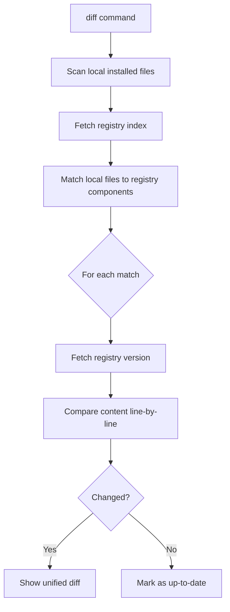
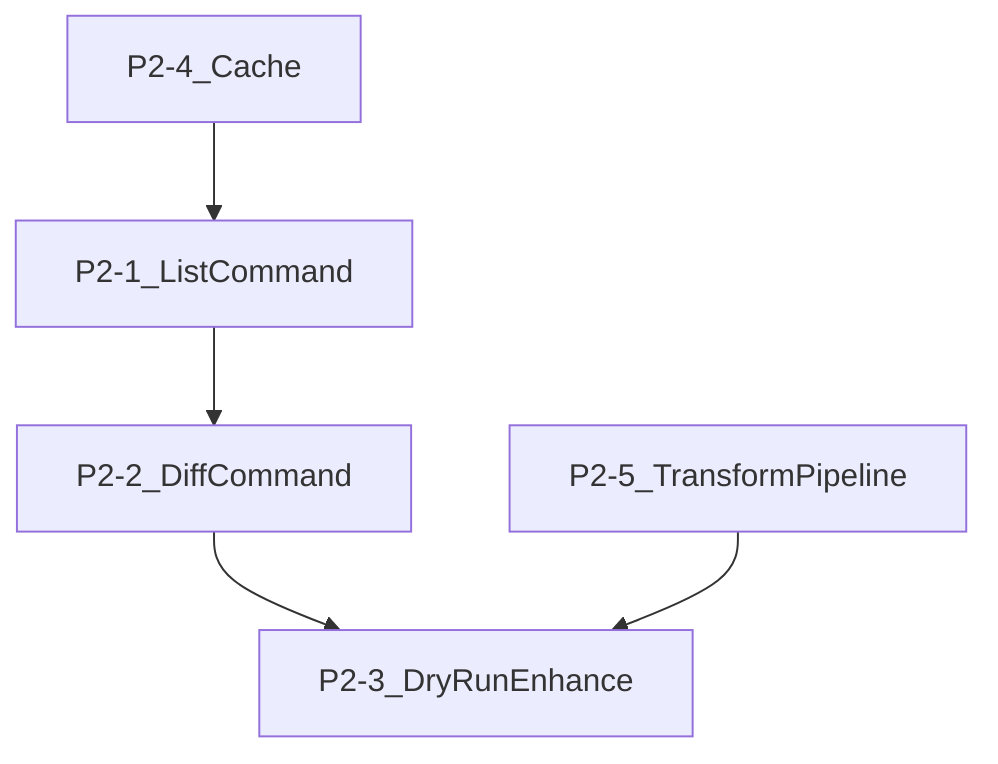

# UI8Kit CLI -- P2 Improvements

Note: `--cwd` for all commands was originally P2 but is already implemented via the global `program.option("-c, --cwd <dir>")` in [src/index.ts](src/index.ts).

---

## P2-1. Command `list` -- view available components

The simplest new command. Fetches the registry index and prints a formatted table of available components, grouped by type. Also serves as a foundation for `diff` (P2-2) since both need to fetch and display index data.

**New file:** `src/commands/list.ts`

**Behavior:**

```
ui8kit list                  # all components from registry
ui8kit list --registry ui    # explicit registry
ui8kit list --json           # machine-readable JSON output
```

**Output format (terminal):**

```
ui (5 components)
  button       UI button component
  input        Text input component
  ...

composite (2 components)
  card         Card container
  ...
```

**Implementation:**

- Import `getAllComponents` from [src/registry/api.ts](src/registry/api.ts) (reuse existing `getRegistryIndex` with `excludeTypes: ["registry:variants", "registry:lib"]`)
- Group by `component.type`, sort alphabetically within groups
- Use `chalk` for colorized output (type headers in cyan, names in white, descriptions dim)
- `--json` flag outputs raw `JSON.stringify` for scripting
- Register in [src/index.ts](src/index.ts) as `program.command("list")`

---

## P2-2. Command `diff` -- compare local components with registry

Shows differences between locally installed components and their registry versions. This is the key "update awareness" feature.

**New file:** `src/commands/diff.ts`

**Behavior:**

```
ui8kit diff                  # show all components with available updates
ui8kit diff button           # show diff for specific component
ui8kit diff --json           # machine-readable output
```

**Implementation flow:**




**Key decisions:**

- Scan local component directories (`src/components/ui/`, `src/components/`, `src/blocks/`, `src/layouts/`) for `.tsx` files
- Match file names (case-insensitive) to registry component names
- For each match, fetch the registry version via `getComponent()` from [src/registry/api.ts](src/registry/api.ts)
- Compare using a simple line-by-line diff algorithm (implement a minimal `diffLines` in a new utility, or add the `diff` npm package -- it is lightweight at ~30KB)
- Output: unified diff format with `+`/`-` lines colored green/red
- Summary at the end: `3 components have updates, 7 are up to date`
- Suggest: `Run "ui8kit add button --force" to update`

**Detecting installed components:**

- Read `ui8kit.config.json` to get `componentsDir`, `libDir`
- Walk `componentsDir/ui/*.tsx`, `componentsDir/*.tsx`, etc.
- Extract base name (e.g. `button.tsx` -> `button`)
- Look up in registry index by name

**New dependency:** `diff` (npm package, ~30KB, used by shadcn for the same purpose) -- for `diffLines` function.

---

## P2-3. Enhanced `--dry-run` for `add`

Currently `--dry-run` shows component name, type, file count, and npm dependencies. Enhance it to show:

1. **Full file paths** that would be created/overwritten
2. **Registry dependency tree** that would be resolved
3. **Diff preview** for files that already exist (reuse diff utility from P2-2)

**Changes to** [src/commands/add.ts](src/commands/add.ts), function `processComponents`:

Current dry-run block (lines 179-192) outputs minimal info. Extend it:

```typescript
if (options.dryRun) {
  spinner.succeed(CLI_MESSAGES.status.wouldInstall(component.name, registryType))
  // Existing output...
  
  // NEW: show file paths and overwrite status
  for (const file of component.files) {
    const target = file.target || inferTargetFromType(component.type)
    const installDir = resolveInstallDir(target, config)
    const targetPath = path.join(process.cwd(), installDir, path.basename(file.path))
    const exists = await fs.pathExists(targetPath)
    const status = exists ? chalk.yellow("overwrite") : chalk.green("create")
    console.log(`   ${status}: ${targetPath}`)
    
    // NEW: show diff for existing files
    if (exists) {
      const currentContent = await fs.readFile(targetPath, "utf-8")
      if (currentContent !== file.content) {
        const diff = diffLines(currentContent, file.content)
        // print compact diff summary
      }
    }
  }
  
  // NEW: show registry dependency tree
  if (component.registryDependencies?.length) {
    console.log(`   Registry deps: ${component.registryDependencies.join(" -> ")}`)
  }
}
```

---

## P2-4. Persistent registry cache

Currently the in-memory `registryCache` Map in [src/registry/api.ts](src/registry/api.ts) only lives for the duration of a single CLI invocation. Add filesystem-based caching so repeated `add`/`list`/`diff` calls within a TTL window skip network requests.

**New file:** `src/utils/cache.ts`

**Cache location:** `~/.ui8kit/cache/` (cross-platform via `os.homedir()`)

**Cache structure:**

```
~/.ui8kit/cache/
  ui/
    index.json          # cached registry index
    components/
      ui/
        button.json     # cached component data
      ...
    meta.json           # { lastFetched: ISO timestamp, ttl: 3600000 }
```

**TTL:** 1 hour (3600000ms) by default.

**API:**

```typescript
export interface CacheOptions {
  ttlMs?: number
  noCache?: boolean
}

export async function getCachedJson(key: string, options?: CacheOptions): Promise<any | null>
export async function setCachedJson(key: string, data: any): Promise<void>
export async function clearCache(): Promise<void>
export function getCacheDir(): string
```

**Integration with** [src/registry/api.ts](src/registry/api.ts):

- `getRegistryIndex()` -- check cache first, fetch only if expired or missing
- `getComponentByType()` -- check cache for individual component JSON
- After successful fetch, write to cache
- `--no-cache` global flag bypasses cache reads (still writes)

**New CLI additions in** [src/index.ts](src/index.ts):

```
program.option("--no-cache", "Bypass registry cache")
```

**New subcommand:** `ui8kit cache clear` -- clears `~/.ui8kit/cache/`

---

## P2-5. Transform pipeline -- rewrite imports during installation

Components from the registry use hardcoded import paths like `@/lib/utils`, `@/components/ui/button`. When the user has different aliases configured in `ui8kit.config.json`, these imports must be rewritten.

**New file:** `src/utils/transform.ts`

**Pipeline concept:**


**Stage 1: `transformImports`** -- the critical transform

Uses TypeScript compiler API (already a dependency) to parse import declarations and rewrite paths:

```typescript
export function transformImports(content: string, aliases: Record<string, string>): string
```

Logic:

- Parse file with `ts.createSourceFile()`
- Walk all `ImportDeclaration` nodes
- For each import specifier (e.g. `@/lib/utils`):
  - Check if the path starts with any alias key from config
  - If the config has a different mapping, rewrite the specifier
  - Example: if config has `"@/lib": "./src/helpers"`, then `import { cn } from "@/lib/utils"` stays as-is because the alias `@/lib` maps to the same convention
  - If the user changed aliases (e.g. `"@/ui": "./src/design/ui"`), rewrite `@/components/ui/button` -> `@/ui/button`
- Reconstruct the source text using simple string replacement at the exact positions from the AST (no need for `ts-morph` -- the built-in TS compiler API provides node positions)

**Stage 2: `transformCleanup`** -- optional post-processing

- Remove leading/trailing whitespace issues
- Ensure consistent line endings

**Integration with** [src/commands/add.ts](src/commands/add.ts), function `installComponentFiles`:

Before writing file content to disk (line 380: `await fs.writeFile(targetPath, file.content, "utf-8")`), run the transform pipeline:

```typescript
const transformedContent = applyTransforms(file.content, config)
await fs.writeFile(targetPath, transformedContent, "utf-8")
```

**Key constraint:** Only transform `.ts` and `.tsx` files. Leave `.css`, `.json`, etc. unchanged.

---

## File Change Summary


| File                        | Action                                                         | P2 Task          |
| --------------------------- | -------------------------------------------------------------- | ---------------- |
| `src/commands/list.ts`      | NEW                                                            | P2-1             |
| `src/commands/diff.ts`      | NEW                                                            | P2-2             |
| `src/utils/cache.ts`        | NEW                                                            | P2-4             |
| `src/utils/transform.ts`    | NEW                                                            | P2-5             |
| `src/commands/add.ts`       | MODIFY -- enhanced dry-run, transform integration              | P2-3, P2-5       |
| `src/registry/api.ts`       | MODIFY -- cache integration                                    | P2-4             |
| `src/index.ts`              | MODIFY -- register `list`, `diff`, `cache clear`, `--no-cache` | P2-1, P2-2, P2-4 |
| `src/utils/cli-messages.ts` | MODIFY -- new messages for list, diff, cache                   | P2-1, P2-2, P2-4 |
| `package.json`              | MODIFY -- add `diff` npm dependency                            | P2-2             |


---

## Execution Order

Tasks are ordered by dependency -- each builds on the previous:




1. **P2-4 Cache** first -- foundational, speeds up all subsequent commands
2. **P2-1 List** -- simple command, uses cache, proves cache works
3. **P2-2 Diff** -- needs list-like index scan + diff utility
4. **P2-5 Transform** -- independent, can be parallelized with diff
5. **P2-3 Dry-run** -- last, integrates diff utility and transform preview

