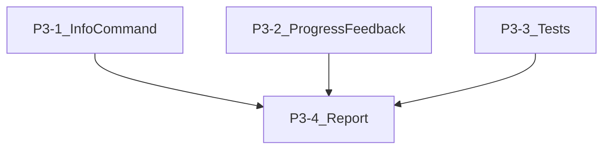

# UI8Kit CLI -- P3 Improvements + Final Report

**Note:** `--verbose` mode was originally P3 but was already implemented in P1 (`src/utils/logger.ts`, global `-v` flag in `src/index.ts`). Skipped.

---

## P3-1. Command `info` -- environment diagnostics

A lightweight command that prints the current environment at a glance for debugging and support.

**New file:** [src/commands/info.ts](src/commands/info.ts)

**Output:**

```
ui8kit v1.2.1
Node    v20.11.0
OS      win32 x64
PM      bun
CWD     E:\_@Bun\my-app

Config  ./ui8kit.config.json (found)
  framework    vite-react
  typescript   true
  globalCss    src/index.css
  componentsDir ./src/components
  libDir        ./src/lib

Registry  @ui8kit
CDN       https://cdn.jsdelivr.net/npm/@ui8kit/registry@latest/r (ok)
Cache     ~/.ui8kit/cache (14 items, 2.1 MB)
```

**Implementation:**

- Import `getCliVersion()` (extract from [src/index.ts](src/index.ts) into a shared helper, or read `package.json` inline)
- Import `detectPackageManager()` from [src/utils/package-manager.ts](src/utils/package-manager.ts)
- Import `findConfig()` from [src/utils/project.ts](src/utils/project.ts)
- Import `getCacheDir()` from [src/utils/cache.ts](src/utils/cache.ts)
- Ping first CDN from `SCHEMA_CONFIG.cdnBaseUrls` with a HEAD request to test connectivity
- Count cached files via `fs.readdir` on cache dir
- Register in [src/index.ts](src/index.ts):

```typescript
program
  .command("info")
  .description("Show environment and config diagnostics")
  .action(infoCommand)
```

---

## P3-2. Progressive feedback for multi-component installs

Currently each component gets its own spinner that appears and disappears sequentially. For multi-component installs, show a numbered progress indicator.

**Changes to** [src/commands/add.ts](src/commands/add.ts), function `processComponents` (lines 153-222):

Replace the per-component `ora` spinner with a counter-based format:

```
Installing 4 components...
  [1/4] button      ✔
  [2/4] input       ✔
  [3/4] dialog      ⠋ installing dependencies...
  [4/4] card
```

**Implementation:**

- Pass `total` count into `processComponents`
- Replace `ora(CLI_MESSAGES.status.installing(...))` with `ora(\`[{index+1}/{total}] {componentName}...)`
- On success: `spinner.succeed(\`[{index+1}/{total}] {componentName})`
- On failure: `spinner.fail(\`[{index+1}/{total}] {componentName})`
- This is a minimal, clean change to a single function

---

## P3-3. Tests with vitest

No tests exist in the project. Add a minimal but meaningful test suite covering core utilities and command logic.

**Setup:**

- Add `vitest` as a devDependency in [package.json](package.json)
- Add `@types/diff` as a devDependency (the `diff` package is already installed)
- Add `"test": "vitest run"` and `"test:watch": "vitest"` to scripts
- Create `vitest.config.ts` at project root (minimal config, ESM, with `src/` as include root)

**Test file structure:**

```
tests/
  utils/
    cache.test.ts           # getCachedJson, setCachedJson, clearCache
    transform.test.ts       # transformImports, transformCleanup, applyTransforms
    diff-utils.test.ts      # buildUnifiedDiff, hasDiff, formatDiffPreview
    dependency-resolver.test.ts  # resolveRegistryTree (with mocked getComponent)
    package-manager.test.ts # detectPackageManager (with mocked fs)
    errors.test.ts          # handleError, isZodError, typed error classes
    logger.test.ts          # setVerbose, debug suppression
    project.test.ts         # findConfig, isViteProject, hasReact
  commands/
    add.test.ts             # resolveInstallDir, inferTargetFromType (unit)
    init.test.ts            # config generation logic (unit, no network)
```

**Test categories and what they cover:**

### Unit tests (pure functions, no I/O mocking needed)

- **transform.test.ts** -- Test `transformImports` with various alias configs:
  - Default aliases (no rewrite expected)
  - Custom aliases (rewrite `@/components/ui/button` to `@/ui/button`)
  - Non-alias imports (unchanged)
  - `transformCleanup` normalizes line endings
  - `shouldTransformFile` returns true for `.ts`/`.tsx`, false for `.css`
- **diff-utils.test.ts** -- Test `hasDiff`, `buildUnifiedDiff`, `formatDiffPreview`:
  - Identical content returns false
  - Different content returns true
  - `formatDiffPreview` truncates at maxLines
- **errors.test.ts** -- Test error class construction:
  - `RegistryNotFoundError` has correct message and suggestion
  - `ConfigNotFoundError` has correct suggestion
  - `isZodError` identifies Zod errors correctly
- **logger.test.ts** -- Test verbose gating:
  - `debug()` is suppressed when verbose=false
  - `debug()` outputs when verbose=true

### Unit tests with fs mocking (use vitest `vi.mock`)

- **cache.test.ts** -- Test cache read/write/TTL:
  - `getCachedJson` returns null for missing cache
  - `getCachedJson` returns null for expired TTL
  - `getCachedJson` returns data for valid TTL
  - `setCachedJson` writes data + meta
  - `clearCache` removes cache directory
  - `noCache: true` bypasses cache
- **package-manager.test.ts** -- Test `detectPackageManager`:
  - Returns "bun" when `bun.lock` exists
  - Returns "pnpm" when `pnpm-lock.yaml` exists
  - Returns "npm" as fallback
  - Reads `packageManager` field from `package.json`
- **project.test.ts** -- Test `findConfig`:
  - Finds config at project root
  - Falls back to `./src/` for backward compat
  - Returns null when no config exists
- **dependency-resolver.test.ts** -- Test `resolveRegistryTree`:
  - Resolves single component with no deps
  - Resolves chain: A -> B -> C in correct order
  - Detects circular dependencies (warns, doesn't crash)
  - Deduplicates components requested multiple times

### Integration-style tests (network mocked)

- **add.test.ts** -- Test `resolveInstallDir` and `inferTargetFromType`:
  - `registry:ui` maps to `components/ui`
  - `registry:lib` maps to `lib`
  - Custom config dirs are respected
- **init.test.ts** -- Test config generation:
  - Default config has correct shape (typescript: true, globalCss: "src/index.css")
  - All required fields present in generated config

---

## P3-4. Final verification and REPORT.md

After all P3 tasks are complete, run every CLI command and produce `REPORT.md` in the project root.

**Commands to test:**


| #   | Command                                       | What to verify                                                        |
| --- | --------------------------------------------- | --------------------------------------------------------------------- |
| 1   | `ui8kit --help`                               | All commands listed (init, add, list, diff, cache, scan, build, info) |
| 2   | `ui8kit --version`                            | Prints current version                                                |
| 3   | `ui8kit info`                                 | Shows env diagnostics without error                                   |
| 4   | `ui8kit init -y`                              | Creates config at root, installs clsx+tailwind-merge, creates dirs    |
| 5   | `ui8kit list`                                 | Lists components grouped by type                                      |
| 6   | `ui8kit list --json`                          | Outputs valid JSON                                                    |
| 7   | `ui8kit add button --dry-run`                 | Shows file paths, deps, no writes                                     |
| 8   | `ui8kit add Button`                           | Case-insensitive, installs successfully                               |
| 9   | `ui8kit add nonexistent`                      | Proper error message                                                  |
| 10  | `ui8kit add` (no args)                        | Multiselect prompt appears                                            |
| 11  | `ui8kit diff`                                 | Compares local vs registry                                            |
| 12  | `ui8kit diff button`                          | Single-component diff                                                 |
| 13  | `ui8kit cache clear`                          | Clears cache without error                                            |
| 14  | `ui8kit scan`                                 | Scans components, generates registry.json                             |
| 15  | `ui8kit -v add button --dry-run`              | Verbose output includes debug lines                                   |
| 16  | `ui8kit --cwd .test-app add button --dry-run` | Global --cwd works                                                    |
| 17  | `vitest run`                                  | All tests pass                                                        |


**REPORT.md format:**

```markdown
# UI8Kit CLI -- Verification Report

Date: YYYY-MM-DD
Version: x.y.z
Node: vXX.XX.X

## Build & Type Check
- [x] `npm run build` -- pass
- [x] `npm run type-check` -- pass

## Commands
| # | Command | Status | Notes |
|---|---------|--------|-------|
| 1 | ui8kit --help | PASS | 8 commands listed |
...

## Tests
- Total: XX
- Passed: XX
- Failed: 0

## Summary
All P0-P3 improvements verified.
```

---

## File Change Summary


| File                                      | Action                                          | Task |
| ----------------------------------------- | ----------------------------------------------- | ---- |
| `src/commands/info.ts`                    | NEW                                             | P3-1 |
| `src/commands/add.ts`                     | MODIFY -- progress counter in processComponents | P3-2 |
| `src/index.ts`                            | MODIFY -- register `info` command               | P3-1 |
| `vitest.config.ts`                        | NEW                                             | P3-3 |
| `tests/utils/cache.test.ts`               | NEW                                             | P3-3 |
| `tests/utils/transform.test.ts`           | NEW                                             | P3-3 |
| `tests/utils/diff-utils.test.ts`          | NEW                                             | P3-3 |
| `tests/utils/dependency-resolver.test.ts` | NEW                                             | P3-3 |
| `tests/utils/package-manager.test.ts`     | NEW                                             | P3-3 |
| `tests/utils/errors.test.ts`              | NEW                                             | P3-3 |
| `tests/utils/logger.test.ts`              | NEW                                             | P3-3 |
| `tests/utils/project.test.ts`             | NEW                                             | P3-3 |
| `tests/commands/add.test.ts`              | NEW                                             | P3-3 |
| `tests/commands/init.test.ts`             | NEW                                             | P3-3 |
| `package.json`                            | MODIFY -- add vitest, test scripts              | P3-3 |
| `REPORT.md`                               | NEW                                             | P3-4 |


## Execution Order




P3-1, P3-2, and P3-3 are independent and can be implemented in any order. P3-4 (REPORT.md) is the final step that validates everything.